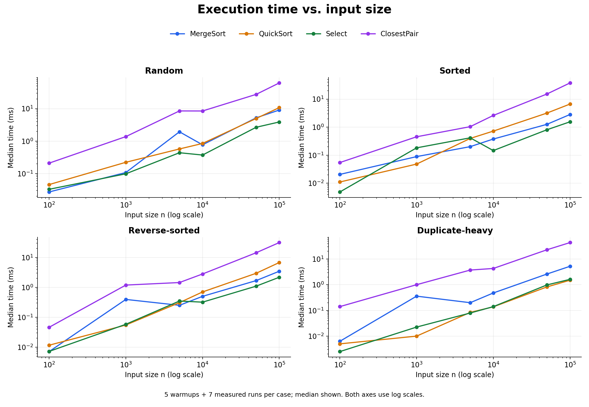
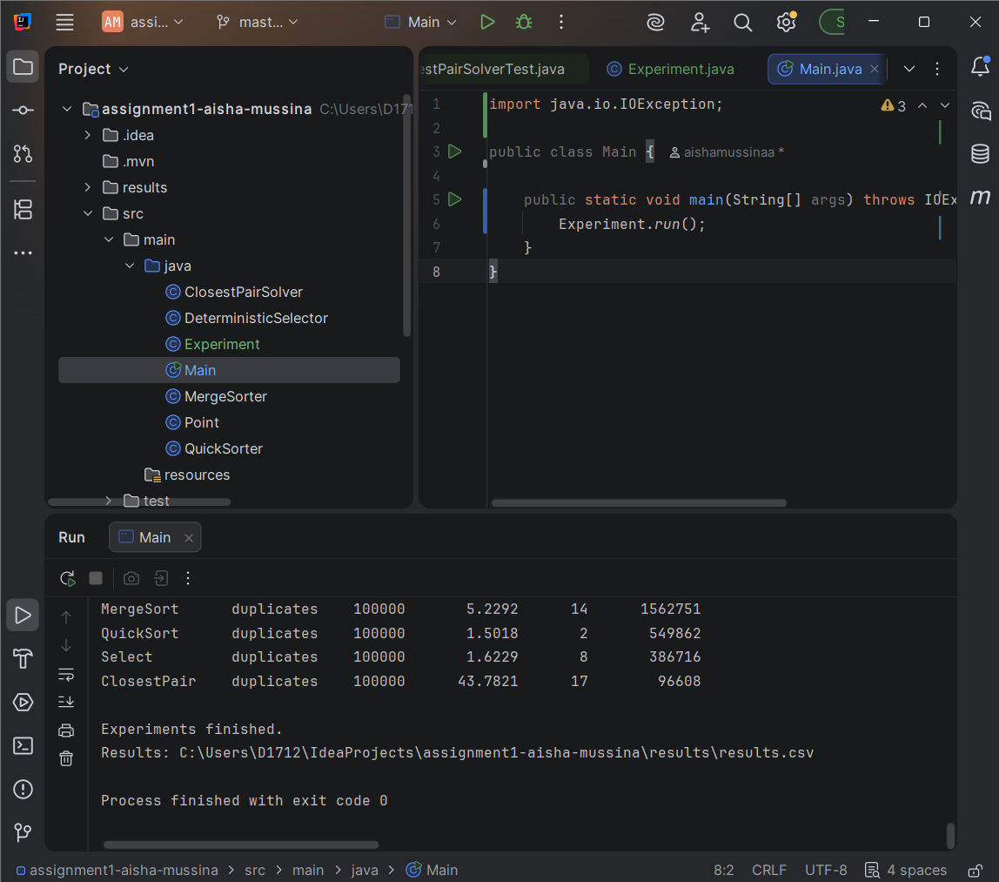
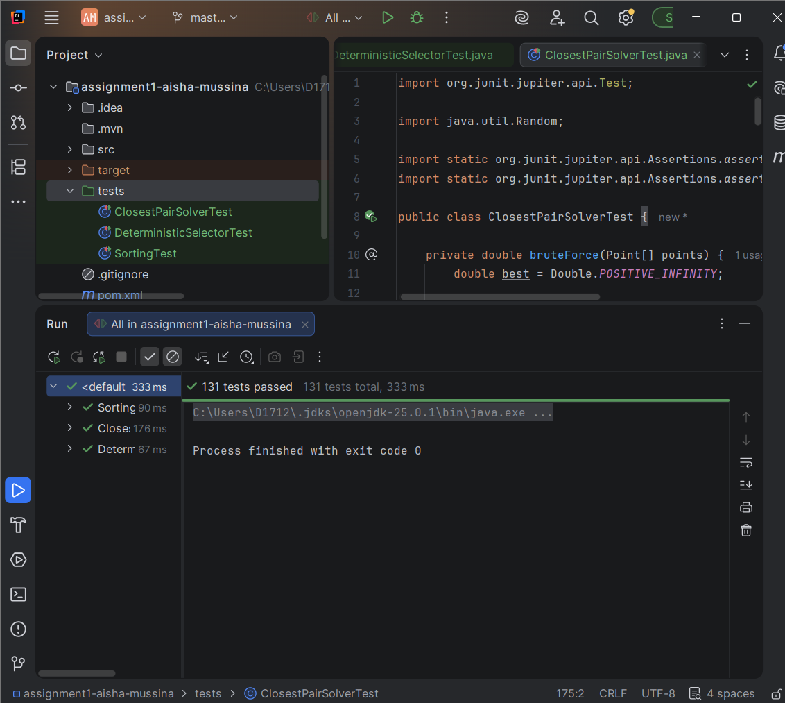
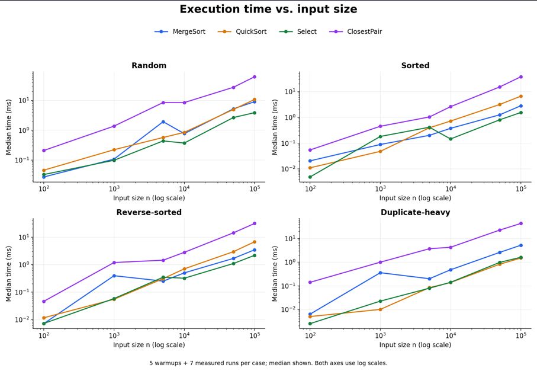
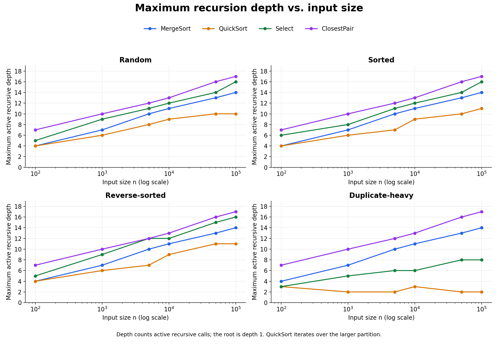

# Assignment 1: Divide-and-Conquer Algorithm Analysis

Author: Aisha Mussina

## Project Overview

This project implements four divide-and-conquer algorithms in Java: MergeSort, randomized QuickSort, Deterministic Select, and Closest Pair of Points.

The goal is to compare theoretical complexity with experimental results. The program measures execution time, maximum recursion depth, and algorithmic operations. Correctness is checked with reference solutions.

## Project Structure

- `src/main/java/` — algorithm implementations, Point, Experiment, and Main.
- `tests/` — JUnit correctness tests.
- `results/results.csv` — experimental measurements.
- `results/environment.txt` — execution environment.
- `docs/plots/` — graphs and the Python plotting script.
- `docs/screenshots/` — program output, tests, and plot screenshots.
- `pom.xml` — Maven configuration.
- `.gitignore` — excluded local and generated files.

## How to Run

The project uses JDK 25 and Maven.

Run these commands from the project root:

```bash
mvn test
mvn compile
java -cp target/classes Main
```

In IntelliJ IDEA, open the project as a Maven project and select JDK 25. Run the tests from the `tests` directory and run `Main` to execute the experiments.

Running Main writes `results/results.csv` and `results/environment.txt`.

To regenerate the plots, install Python and matplotlib, then run:

```bash
python -m pip install matplotlib
python docs/plots/plot_results.py
```

## Algorithm Analysis

### MergeSort

MergeSort divides an array into two halves, sorts both halves, and merges them in linear time. One auxiliary array is allocated at the start and reused during merging.

Subarrays of at most 16 elements are sorted with Insertion Sort. This reduces recursive overhead for small inputs.

The recurrence is:

T(n) = 2T(n/2) + Θ(n)

In the Master Theorem, a = 2, b = 2, and f(n) = Θ(n). Since n^(log_b a) = n, case 2 gives Θ(n log n).

The constant cutoff does not change this asymptotic result.

- Time: Θ(n log n).
- Extra space: O(n) for the buffer.
- Recursion stack: O(log n).

### QuickSort

QuickSort chooses a random pivot and partitions the array in place into values smaller than, equal to, and greater than the pivot. Equal values do not need further sorting.

The implementation recursively sorts the smaller partition and processes the larger partition with a loop.

For distinct values, the recurrence depends on the pivot position:

T(n) = T(k) + T(n - k - 1) + Θ(n)

Balanced partitions give T(n) = 2T(n/2) + Θ(n), which is Θ(n log n) by the Master Theorem. Random pivots give expected Θ(n log n) time over the pivot choices.

In the worst case, partitions repeatedly have sizes 0 and n - 1:

T(n) = T(n - 1) + Θ(n) = Θ(n²)

The Master Theorem does not directly apply to this unbalanced recurrence.

- Expected time: Θ(n log n).
- Worst-case time: Θ(n²).
- Partitioning space: O(1).
- Total extra space, including the recursion stack: O(log n).

### Deterministic Select

Deterministic Select finds the value that would occupy index k in a sorted array. The index is zero-based, and the input array is modified.

The algorithm sorts groups of at most five elements and moves their medians to the beginning of the current range. It recursively selects the median of these medians as the pivot.

After in-place three-way partitioning, it continues only in the partition containing index k. If k belongs to the equal section, the pivot is the answer.

The worst-case recurrence bound is:

T(n) ≤ T(⌈n/5⌉) + T(7n/10 + O(1)) + Θ(n)

The first recursive call selects the pivot. The second searches the required partition.

Ignoring rounding, the recursive fractions add up to 1/5 + 7/10 = 9/10. The amount of work decreases geometrically across levels.

In Akra–Bazzi terms, p satisfies (1/5)^p + (7/10)^p = 1. Since p < 1 and the nonrecursive work is linear, the bound is O(n). The top-level scan also requires Ω(n), giving Θ(n) worst-case time.

- Worst-case time: Θ(n).
- Extra space: O(log n) for recursion.
- Groups and partitions are processed in place.

### Closest Pair of Points

The solver first sorts a copy of the points by x-coordinate. It divides the range into two halves and recursively finds the smallest distance in each half.

A closer pair may cross the dividing line. The algorithm builds a strip containing points close enough to that line and checks them in y-order.

Each recursive call returns its range sorted by y-coordinate. The two ranges are merged in linear time, avoiding a new full sort at every level.

The strip checks at most the next seven points for each point and stops earlier when the y-distance is already too large. The geometric packing argument bounds the number of relevant neighbours.

The recursive phase has the recurrence:

T(n) = 2T(n/2) + Θ(n)

Master Theorem case 2 gives Θ(n log n). The initial x-sort also takes O(n log n), so the total remains Θ(n log n).

- Time: Θ(n log n).
- Extra space: O(n) for the copied points and reusable buffers.
- Recursion stack: O(log n).

For fewer than two points, the solver returns positive infinity. Duplicate points produce distance zero.

## Correctness Testing

The JUnit run passed all 131 tests.

### Sorting

Both sorting algorithms are compared with `Arrays.sort()`.

Tests include empty arrays, single elements, random arrays, sorted arrays, reverse-sorted arrays, duplicates, equal values, and extreme integer values. Small sizes around the MergeSort cutoff are also checked.

### Deterministic Select

There are 100 repeated random tests. Each test sorts a reference copy and compares the selected value with the value at index k.

Additional tests cover every possible k in small arrays, sorted and reverse-sorted inputs, duplicates, equal values, extreme integers, and invalid indices.

### Closest Pair

Small datasets are compared with an O(n²) brute-force implementation. Tests include random datasets and a dataset of 2,000 points.

Other cases include empty and single-point inputs, duplicate points, horizontal and vertical lines, and a closest pair crossing the dividing line.

A large test uses 100,000 points with a known minimum distance and runs only the fast solver.

## Experimental Method

The experiments use input sizes 100, 1,000, 5,000, 10,000, 50,000, and 100,000.

For each size, the input types are random, sorted, reverse-sorted, and duplicate-heavy. Duplicate-heavy integer arrays contain values from 0 to 9. Duplicate-heavy point coordinates also come from 0 to 9.

Sorted and reverse-sorted point inputs are ordered by x-coordinate. Their underlying point sets are the same as the random case of the same size.

Each case has five warmup runs and seven measured runs. Timing uses `System.nanoTime()`. The CSV records median, minimum, and maximum time in nanoseconds.

Input generation and correctness checks are outside the timed section. Integer array copies are also made before timing. Closest Pair timing includes its internal copy, initial sort, and buffer allocation.

Selection experiments use k = n / 2. Small Closest Pair experiments are checked against brute force outside the timer.

The base random seed is 2026. Repetitions reuse the same input, and QuickSort uses the same pivot seed for reproducibility. These repetitions measure timing variation, not variation across independent random datasets.

Maximum depth counts active recursive algorithm calls, with the root at depth 1. It does not count QuickSort loop iterations as new recursive calls.

The additional metric is element comparisons for sorting and selection, and distance evaluations for Closest Pair. Closest Pair's metric does not include comparisons made during sorting or merging.

Environment: OpenJDK 25.0.1, Windows 11, amd64, and 8 processors available to the JVM.

### Median Time on Random Inputs

All times below are in milliseconds.

| n | MergeSort | QuickSort | Select | Closest Pair |
|---:|---:|---:|---:|---:|
| 100 | 0.0270 | 0.0456 | 0.0326 | 0.2090 |
| 1,000 | 0.1072 | 0.2220 | 0.0980 | 1.3745 |
| 5,000 | 1.9352 | 0.5716 | 0.4377 | 8.5115 |
| 10,000 | 0.7680 | 0.8456 | 0.3712 | 8.4823 |
| 50,000 | 5.2197 | 4.9831 | 2.6685 | 27.5929 |
| 100,000 | 9.0742 | 10.7786 | 3.8859 | 62.1674 |

### Maximum Recursion Depth on Random Inputs

| n | MergeSort | QuickSort | Select | Closest Pair |
|---:|---:|---:|---:|---:|
| 100 | 4 | 4 | 5 | 7 |
| 1,000 | 7 | 6 | 9 | 10 |
| 5,000 | 10 | 8 | 11 | 12 |
| 10,000 | 11 | 9 | 12 | 13 |
| 50,000 | 13 | 10 | 14 | 16 |
| 100,000 | 14 | 10 | 16 | 17 |

### Input Types at n = 100,000

Median execution time in milliseconds:

| Input type | MergeSort | QuickSort | Select | Closest Pair |
|---|---:|---:|---:|---:|
| Random | 9.0742 | 10.7786 | 3.8859 | 62.1674 |
| Sorted | 2.8321 | 6.6739 | 1.5536 | 37.7633 |
| Reverse | 3.4600 | 6.7654 | 2.1767 | 31.4737 |
| Duplicates | 5.2292 | 1.5018 | 1.6229 | 43.7821 |

Maximum recursion depth:

| Input type | MergeSort | QuickSort | Select | Closest Pair |
|---|---:|---:|---:|---:|
| Random | 14 | 10 | 16 | 17 |
| Sorted | 14 | 11 | 16 | 17 |
| Reverse | 14 | 11 | 16 | 17 |
| Duplicates | 14 | 2 | 8 | 17 |

### Algorithmic Operations on Random Inputs

| n | MergeSort comparisons | QuickSort comparisons | Select comparisons | Closest Pair distance checks |
|---:|---:|---:|---:|---:|
| 10,000 | 127,118 | 224,613 | 98,825 | 13,042 |
| 50,000 | 769,830 | 1,467,135 | 503,346 | 71,212 |
| 100,000 | 1,639,491 | 3,473,571 | 1,004,782 | 142,584 |

The operation columns measure different kinds of work, so they should not be compared as identical units.

All 96 combinations of algorithm, size, and input type are available in [results.csv](results/results.csv).

### Time vs. Input Size



### Recursion Depth vs. Input Size


## Discussion

### Do the results match theoretical complexity?

The operation counts and slowly increasing recursion depths are consistent with the analysis. For example, Select uses about 10 comparisons per element on the larger random inputs, which supports linear growth.

Execution times are less smooth. MergeSort took 1.9352 ms for 5,000 random elements but 0.7680 ms for 10,000. These are the measured values, and they were not adjusted. Short measurements can be affected by JVM warmup and system activity.

The experiments support the theoretical trends, but a finite set of measurements does not prove an asymptotic bound.

### How does input structure affect performance?

QuickSort benefits strongly from duplicate-heavy data because three-way partitioning removes equal values from further processing. At 100,000 elements, its measured depth drops from 10 on random input to 2 on duplicate-heavy input.

MergeSort keeps the same splitting structure for all input types, but comparison counts and insertion-sort work change. Sorted input was faster in this run.

Select also benefits when the equal section contains the target index.

Closest Pair sorts the points before recursion. Random, sorted, and reverse inputs contain the same points and produce the same distance-check counts, but their initial sorting costs and measured times can differ.

### Why does smaller-first recursion help QuickSort?

The smaller partition contains at most half of the current elements. Every nested recursive call therefore reduces the problem size by at least a factor of two.

The larger partition is handled by a loop, so it does not add another stack frame. This guarantees O(log n) stack space even when poor pivots cause O(n²) total work.

### Why does Median-of-Medians guarantee linear time?

In a full group of five, at least three elements are no smaller than its median, and at least three are no greater.

The median of the group medians therefore guarantees that roughly 30% of the elements are on each non-strict side of the pivot, apart from a constant rounding adjustment. After three-way partitioning, the required strict partition has at most about 70% of the elements.

Choosing the pivot costs T(n/5), searching costs at most T(7n/10 + O(1)), and grouping and partitioning take linear work. The total is Θ(n).

### Why is Closest Pair faster than brute force for large inputs?

Brute force checks every pair, giving n(n - 1)/2 distance evaluations and Θ(n²) time.

Divide-and-conquer uses geometric restrictions to avoid checking most pairs. Merging and strip processing take linear work per recursion level, giving Θ(n log n) overall.

For 100,000 points, brute force would check 4,999,950,000 pairs. The fast solver made 142,584 distance checks on the random dataset, plus sorting and merging work. This is an operation-count comparison; brute-force execution time was not measured at that size.

### What practical factors affect performance?

JIT compilation and JVM warmup can change execution time during a run. Cache locality, branch prediction, object allocation, garbage collection, and background programs can also affect the measurements.

MergeSort uses sequential buffer access, while Closest Pair works with Point objects and computes distances. The algorithms also solve different problems, so their absolute times are not a direct ranking of interchangeable solutions.

Five warmup runs and seven measured runs reduce some noise, but this is a small educational benchmark. Fixed execution order, one dataset per case, and instrumentation overhead limit the conclusions.

## Reflection

This assignment helped me connect recursive code with recurrence relations. I also learned that recursion depth and running time describe different things. QuickSort can keep a small stack while still doing quadratic work when its pivots are poor.

The parts that required the most attention were partition boundaries, duplicate values, and preserving y-order in Closest Pair. Comparing the results with reference methods helped check correctness. The measurements also showed me why one execution time is not enough to judge an algorithm.

## Screenshots

### Program Output



### Test Results



### Time Plot Screenshot



### Depth Plot Screenshot

